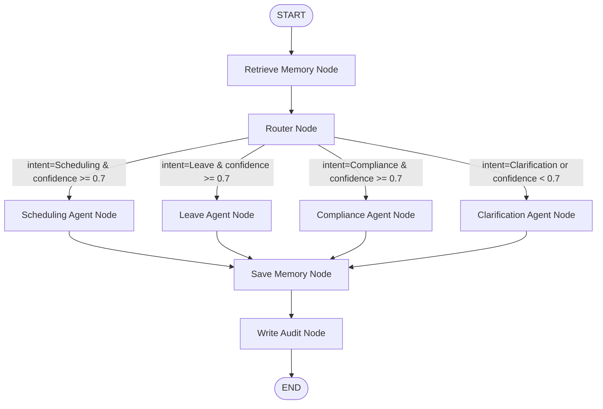

# Multi-Agent Task Routing and Memory Engine - Implementation Plan

This plan outlines the architecture, database design, routing logic, and implementation steps for developing the multi-agent task routing and memory engine for the ZeloraTech HR automation platform.

## Design Goals & Architecture

We will implement a modular, clean, and robust backend using:
- **FastAPI** for the REST API endpoints.
- **Langgraph** for orchestrating the multi-agent system state machine.
- **SQLite** for storing two-tier memory and append-only audit logs.
- **Pydantic** for data schemas and request validation.
- **A Unified LLM Service** that supports real LLM integration (via Langchain/LiteLLM or direct SDKs) and a robust, local **Deterministic NLP Fallback** to enable seamless sandboxed testing without internet access/API keys.

### Directory Structure

We will create a new directory `hr_agent_engine` under `C:\Users\ASUS\.gemini\antigravity\scratch\hr_agent_engine` with the following structure:

```
hr_agent_engine/
├── .env                  # Environment configurations (DB paths, API keys)
├── .env.example          # Configuration template
├── requirements.txt      # Package dependencies
├── README.md             # Developer docs & Setup instructions
├── run.py                # App entrypoint (Uvicorn launcher)
├── main.py               # FastAPI application setup
├── database/
│   ├── __init__.py
│   ├── db.py             # SQLite connection and schema initializers
│   ├── memory_store.py   # Short-Term and Long-Term Memory DB handlers
│   └── audit_logger.py   # Append-only audit logger DB handler
├── agents/
│   ├── __init__.py
│   ├── orchestrator.py   # Langgraph orchestration graph definitions
│   ├── router.py         # Intent classifier and router node
│   ├── scheduling.py     # Scheduling Agent sub-agent stub
│   ├── leave.py          # Leave Agent sub-agent stub
│   ├── compliance.py     # Compliance Agent sub-agent stub
│   └── clarification.py  # Clarification Agent sub-agent stub
├── schemas/
│   ├── __init__.py
│   └── models.py         # Pydantic schema declarations
└── utils/
    ├── __init__.py
    ├── llm.py            # Unified LLM provider (real LLM + offline Mock LLM fallback)
    └── logger.py         # Global logging helper
```

---

## 1. REST API Endpoints

We will define 5 REST API endpoints under `/api/v1`:

1. **Request Handling**: `POST /api/v1/request`
   - **Request Body**:
     ```json
     {
       "user_id": "usr_9876",
       "session_id": "sess_112233",
       "text": "Can you book a meeting with Sarah tomorrow at 10 AM?"
     }
     ```
   - **Response Body**:
     ```json
     {
       "request_id": "req_abc123",
       "intent": "Scheduling",
       "confidence": 0.95,
       "response": "Sure, I can help schedule that meeting. [Stub: Scheduling Agent simulated booking with Sarah tomorrow at 10 AM]",
       "execution_time_ms": 120.4,
       "status": "SUCCESS"
     }
     ```

2. **Audit Retrieval**: `GET /api/v1/audit`
   - **Query Parameters**: `user_id` (optional), `limit` (default: 50), `offset` (default: 0)
   - **Response Body**: Array of audit log records.

3. **Memory Retrieval**: `GET /api/v1/memory`
   - **Query Parameters**: `user_id` (required), `session_id` (optional), `type` (optional: `short_term` or `long_term`)
   - **Response Body**: Array of retrieved memories.

4. **Memory Management**: `POST /api/v1/memory`
   - **Request Body**: Manually inject or update a memory entry.
     ```json
     {
       "user_id": "usr_9876",
       "session_id": "sess_112233",
       "content": "User prefers morning meetings.",
       "memory_type": "long_term",
       "significance_score": 8
     }
     ```
   - **Response Body**: Created memory object.

5. **Health Monitoring**: `GET /api/v1/health`
   - Checks SQLite database connectivity, presence of configurations, and checks active agent services.
   - **Response Body**:
     ```json
     {
       "status": "healthy",
       "database_connected": true,
       "llm_provider": "MockLLM (Offline)",
       "timestamp": "2026-05-21T10:30:00Z"
     }
     ```

---

## 2. Multi-Agent Router & Sub-Agent Stubs (Langgraph)

### State Graph Configuration

We will model the system as a Langgraph `StateGraph` containing:
- **State Fields**:
  - `user_id`: string
  - `session_id`: string
  - `user_input`: string
  - `detected_intent`: string
  - `confidence_score`: float
  - `memory_context`: string (injected historical context)
  - `agent_response`: string
  - `retry_count`: int
  - `errors`: list of strings

### Graph Nodes & Layout



- **Router Node**: Invokes LLM/NLP router to classify intent into `Scheduling`, `Leave`, `Compliance`, or `Clarification`. Returns confidence score.
- **Sub-Agent Nodes**: 
  - Each agent will be stubbed to perform context-dependent logic and return specialized output.
  - E.g., The `SchedulingAgent` will format calendar event templates.
  - The `LeaveAgent` will simulate leave balance checks.
  - The `ComplianceAgent` will reference HR policy documents (mocked).
  - The `ClarificationAgent` will format a polite response asking the user to provide more specific details.

### Timeout and Retry Logic

- **Retry**: If a node fails (e.g., LLM rate limit or database lock), the state tracks `retry_count` and re-attempts the node action up to 3 times with exponential backoff.
- **Timeout**: The FastAPI endpoint runs the graph inside an asynchronous wrapper with a strict timeout (e.g., 10 seconds). If it times out, the system catches the error and returns a polite fallback response without exposing raw Python stack traces.

---

## 3. Two-Tier Memory System

The memory system is backed by SQLite and manages short-term and long-term storage:

### SQLite Schemas

#### Memory Table (`memories`)
- `id` (INTEGER PRIMARY KEY AUTOINCREMENT)
- `user_id` (TEXT NOT NULL)
- `session_id` (TEXT)
- `content` (TEXT NOT NULL)
- `memory_type` (TEXT NOT NULL) -- 'short_term' or 'long_term'
- `significance_score` (INTEGER NOT NULL) -- 1 to 10
- `created_at` (TIMESTAMP DEFAULT CURRENT_TIMESTAMP)
- `metadata` (TEXT) -- JSON object containing details like token count, source, etc.

### Memory Retrieval (Context Injection)
- **Short-Term Memory (STM)**: Retrieves the last 5 interactions belonging to the current `session_id`.
- **Long-Term Memory (LTM)**: Retrieves all items matching the `user_id` with `memory_type = 'long_term'`.
- Before routing, the retrieved context is compiled into a text block and injected into the Orchestrator/Router prompt.

### Significance Scoring & Consolidation Logic
- Every new interaction (user input + agent response) is evaluated for significance.
- **Significance Score Logic**:
  - The interaction is assessed by the significance evaluator (LLM or deterministic keyword/length scorer).
  - **Scoring Rules**:
    - **Score 1-3 (Low)**: Short greetings, generic statements ("hi", "yes", "thanks"), or requests for clarification.
    - **Score 4-6 (Medium)**: Transient requests with minimal long-term value (e.g. booking a one-off lunch appointment).
    - **Score 7-10 (High)**: Contains critical profile details (user preferences, team names, manager name), legal/compliance decisions, or persistent constraints (e.g., "I will be working remotely every Tuesday", "My email is ...", "I got approval from Bob to take leave next Monday").
  - **Consolidation**:
    - **All** interactions are saved in the database as part of the session transcript (or as short-term memory nodes).
    - If the significance score is **>= 7**, the evaluator extracts the core fact and inserts it as a new `long_term` memory record for the `user_id`.

---

## 4. Append-Only Audit Log

To ensure traceability and auditability, we will enforce append-only constraints on the audit log.

### SQLite Schema (`audit_logs`)
- `id` (INTEGER PRIMARY KEY AUTOINCREMENT)
- `request_id` (TEXT UNIQUE NOT NULL)
- `timestamp` (TIMESTAMP DEFAULT CURRENT_TIMESTAMP)
- `user_id` (TEXT NOT NULL)
- `session_id` (TEXT NOT NULL)
- `user_input` (TEXT NOT NULL)
- `detected_intent` (TEXT NOT NULL)
- `confidence_score` (REAL NOT NULL)
- `routed_agent` (TEXT NOT NULL)
- `retrieved_memory_context` (TEXT)
- `agent_response` (TEXT NOT NULL)
- `execution_time_ms` (REAL NOT NULL)
- `status` (TEXT NOT NULL) -- 'SUCCESS', 'FAILED'
- `errors` (TEXT)

### Append-Only Enforcement
- The database connection layer exposes a class `AuditLogger` that only implements an `insert_log` method.
- There are no `update` or `delete` queries written in the code for the `audit_logs` table.
- A database trigger can be set up in SQLite to prevent standard updates and deletions on this table:
  ```sql
  CREATE TRIGGER IF NOT EXISTS limit_audit_log_update BEFORE UPDATE ON audit_logs
  BEGIN
      SELECT RAISE(FAIL, 'Updates are not allowed on the append-only audit_logs table.');
  END;

  CREATE TRIGGER IF NOT EXISTS limit_audit_log_delete BEFORE DELETE ON audit_logs
  BEGIN
      SELECT RAISE(FAIL, 'Deletions are not allowed on the append-only audit_logs table.');
  END;
  ```

---

## Verification Plan

### Automated Tests
1. **Unit Tests**:
   - Write pytest tests for database functions (ensuring triggers block updates/deletes in the audit log).
   - Test the routing logic using both simulated inputs and mocks.
   - Test the memory significance evaluator (heuristics + LLM mock).
2. **Integration Tests**:
   - Write a FastAPI test suite using `TestClient` to verify the 5 REST API endpoints.
   - Run end-to-end routing with multiple sessions to verify that STM and LTM are correctly retrieved and injected.

### Manual Verification
- Start the server using Uvicorn on localhost (`127.0.0.1:8000`).
- Invoke the endpoints using PowerShell `Invoke-RestMethod` and verify responses.
- We will document all commands and outputs in the `walkthrough.md` artifact.

---

## Open Questions & Review Required

> [!NOTE]
> Since we are running in a restricted sandbox, we will configure a local Mock LLM that uses advanced regex, keyword intent mapping, and templates to simulate the LLM's classification and response generation.
> The Mock LLM will allow the system to run locally without an external OpenAI/Gemini API key. 
> If an API key is specified in `.env`, the system will automatically use the real Langchain/LiteLLM provider.

> [!IMPORTANT]
> **Workspace Recommendation**: Once the `hr_agent_engine` subdirectory is created, it is recommended to set it as the active workspace in the IDE.
